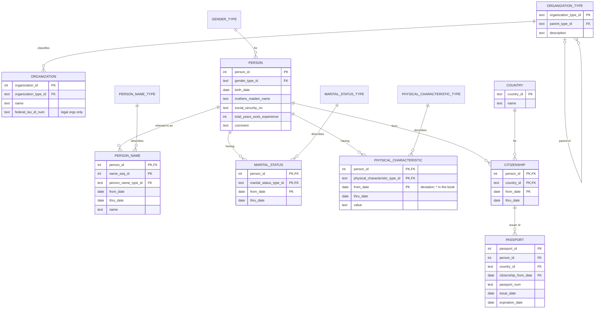

# Vol 1, Chapter 2 — ER diagram

The diagram shows what `schema.sql` implements, not the book's figures.
`person_flat` (Fig 2.2a) is also loaded, for comparison only, and is left out here.

```mermaid
erDiagram
  %% Fig 2.1 — Organization
  ORGANIZATION_TYPE |o--o{ ORGANIZATION_TYPE : "parent of"
  ORGANIZATION_TYPE ||--o{ ORGANIZATION : "classifies"

  %% Fig 2.2b — Person, alternate model
  GENDER_TYPE                  ||--o{ PERSON                  : "for"
  PERSON                       ||--o{ PERSON_NAME             : "referred to as"
  PERSON_NAME_TYPE             ||--o{ PERSON_NAME             : "describes"
  PERSON                       ||--o{ MARITAL_STATUS          : "having"
  MARITAL_STATUS_TYPE          ||--o{ MARITAL_STATUS          : "describes"
  PERSON                       ||--o{ PHYSICAL_CHARACTERISTIC : "having"
  PHYSICAL_CHARACTERISTIC_TYPE ||--o{ PHYSICAL_CHARACTERISTIC : "describes"
  PERSON                       ||--o{ CITIZENSHIP             : "from"
  COUNTRY                      ||--o{ CITIZENSHIP             : "for"
  CITIZENSHIP                  ||--o{ PASSPORT                : "issuer of"

  ORGANIZATION_TYPE {
    text organization_type_id PK
    text parent_type_id FK
    text description
  }
  ORGANIZATION {
    int  organization_id PK
    text organization_type_id FK
    text name
    text federal_tax_id_num "legal orgs only"
  }
  PERSON {
    int  person_id PK
    text gender_type_id FK
    date birth_date
    text mothers_maiden_name
    text social_security_no
    int  total_years_work_experience
    text comment
  }
  PERSON_NAME {
    int  person_id PK, FK
    int  name_seq_id PK
    text person_name_type_id FK
    date from_date
    date thru_date
    text name
  }
  MARITAL_STATUS {
    int  person_id PK, FK
    text marital_status_type_id PK, FK
    date from_date PK
    date thru_date
  }
  PHYSICAL_CHARACTERISTIC {
    int  person_id PK, FK
    text physical_characteristic_type_id PK, FK
    date from_date PK "deviation: * in the book"
    date thru_date
    text value
  }
  CITIZENSHIP {
    int  person_id PK, FK
    text country_id PK, FK
    date from_date PK
    date thru_date
  }
  PASSPORT {
    int  passport_id PK
    int  person_id FK
    text country_id FK
    date citizenship_from_date FK
    text passport_num
    date issue_date
    date expiration_date
  }
  COUNTRY {
    text country_id PK
    text name
  }
```
