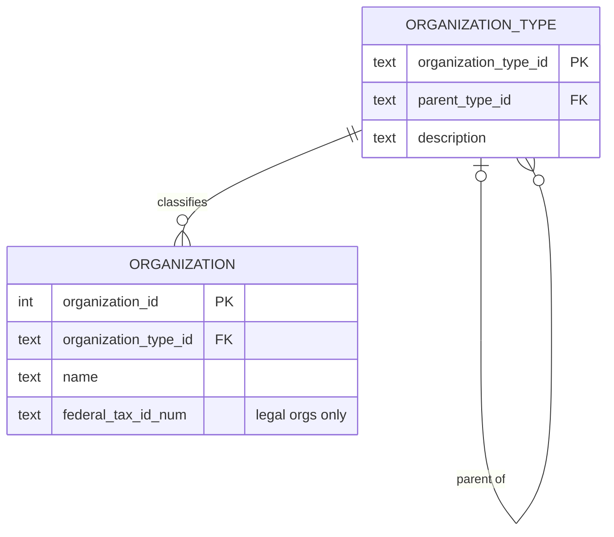

# Vol 1, Chapter 2 — ER diagram

The diagram shows what `schema.sql` implements, not the book's figures.

```mermaid
erDiagram
  ORGANIZATION_TYPE |o--o{ ORGANIZATION_TYPE : "parent of"
  ORGANIZATION_TYPE ||--o{ ORGANIZATION : "classifies"

  ORGANIZATION_TYPE {
    text organization_type_id PK
    text parent_type_id FK
    text description
  }
  ORGANIZATION {
    int  organization_id PK
    text organization_type_id FK
    text name
    text federal_tax_id_num "legal orgs only"
  }
```
