# Vol 1, Chapter 2 — ER diagram

The diagram shows what `schema.sql` implements, not the book's figures.
`person_flat` (Fig 2.2a) is also loaded, for comparison only, and is left out here.

`PERSON` and `ORGANIZATION` are subtypes of `PARTY`: they share its `party_id` (1:1).
`party_kind` says which one a party should be (checked by a data-quality query).
Every table has a single-column key and plain foreign keys.

```mermaid
erDiagram
  %% Fig 2.3 — Party supertype and classification
  PARTY        ||--o| PERSON               : "is a"
  PARTY        ||--o| ORGANIZATION         : "is a"
  PARTY        ||--o{ PARTY_CLASSIFICATION : "classified into"
  PARTY_TYPE   ||--o{ PARTY_CLASSIFICATION : "the description for"
  PARTY_TYPE   |o--o{ PARTY_TYPE           : "parent of"

  %% Fig 2.4 — Party roles
  PARTY     ||--o{ PARTY_ROLE : "acting as"
  ROLE_TYPE ||--o{ PARTY_ROLE : "describes"
  ROLE_TYPE |o--o{ ROLE_TYPE  : "parent of"

  %% Fig 2.5 — Specific party relationships (each links two party roles)
  PARTY_ROLE ||--o{ EMPLOYMENT            : "employer of"
  PARTY_ROLE ||--o{ EMPLOYMENT            : "employed within"
  PARTY_ROLE ||--o{ CUSTOMER_RELATIONSHIP : "customer in"
  PARTY_ROLE ||--o{ CUSTOMER_RELATIONSHIP : "internal org in"
  PARTY_ROLE ||--o{ ORGANIZATION_ROLLUP   : "within"
  PARTY_ROLE ||--o{ ORGANIZATION_ROLLUP   : "made up of"

  %% Fig 2.6a — Common party relationships (generic)
  PARTY_RELATIONSHIP_TYPE ||--o{ PARTY_RELATIONSHIP      : "describes"
  PARTY_ROLE              ||--o{ PARTY_RELATIONSHIP      : "from"
  PARTY_ROLE              ||--o{ PARTY_RELATIONSHIP      : "to"
  ROLE_TYPE               ||--o{ PARTY_RELATIONSHIP_TYPE : "used to define (from)"
  ROLE_TYPE               ||--o{ PARTY_RELATIONSHIP_TYPE : "used to define (to)"

  %% Fig 2.7 — Party relationship information
  PRIORITY_TYPE      |o--o{ PARTY_RELATIONSHIP  : "set the priority for"
  STATUS_TYPE        |o--o{ PARTY_RELATIONSHIP  : "set the status for"
  STATUS_TYPE        |o--o{ STATUS_TYPE         : "parent of"
  PARTY_RELATIONSHIP ||--o{ COMMUNICATION_EVENT : "contacted via"

  %% Fig 2.8 — Postal address information
  PARTY                    ||--o{ PARTY_POSTAL_ADDRESS            : "residing at"
  POSTAL_ADDRESS           ||--o{ PARTY_POSTAL_ADDRESS            : "the location for"
  POSTAL_ADDRESS           ||--o{ POSTAL_ADDRESS_BOUNDARY         : "within"
  GEOGRAPHIC_BOUNDARY      ||--o{ POSTAL_ADDRESS_BOUNDARY         : "for"
  GEOGRAPHIC_BOUNDARY      ||--o{ GEOGRAPHIC_BOUNDARY_ASSOCIATION : "from (within)"
  GEOGRAPHIC_BOUNDARY      ||--o{ GEOGRAPHIC_BOUNDARY_ASSOCIATION : "to (in)"
  GEOGRAPHIC_BOUNDARY_TYPE ||--o{ GEOGRAPHIC_BOUNDARY             : "the description for"

  %% Fig 2.9 — Party contact mechanism
  PARTY                  ||--o{ PARTY_CONTACT_MECHANISM   : "contacted via"
  CONTACT_MECHANISM      ||--o{ PARTY_CONTACT_MECHANISM   : "used by"
  CONTACT_MECHANISM      ||--o| TELECOMMUNICATIONS_NUMBER : "is a"
  CONTACT_MECHANISM      ||--o| ELECTRONIC_ADDRESS        : "is a"
  CONTACT_MECHANISM_TYPE ||--o{ CONTACT_MECHANISM         : "the description for"

  %% Fig 2.1 — Organization
  ORGANIZATION_TYPE |o--o{ ORGANIZATION_TYPE : "parent of"
  ORGANIZATION_TYPE ||--o{ ORGANIZATION      : "classifies"

  %% Fig 2.2b — Person, alternate model
  GENDER_TYPE                  ||--o{ PERSON                  : "for"
  PERSON                       ||--o{ PERSON_NAME             : "referred to as"
  PERSON_NAME_TYPE             ||--o{ PERSON_NAME             : "describes"
  PERSON                       ||--o{ MARITAL_STATUS          : "having"
  MARITAL_STATUS_TYPE          ||--o{ MARITAL_STATUS          : "describes"
  PERSON                       ||--o{ PHYSICAL_CHARACTERISTIC : "having"
  PHYSICAL_CHARACTERISTIC_TYPE ||--o{ PHYSICAL_CHARACTERISTIC : "describes"
  PERSON                       ||--o{ CITIZENSHIP             : "from"
  GEOGRAPHIC_BOUNDARY          ||--o{ CITIZENSHIP             : "country for"
  CITIZENSHIP                  ||--o{ PASSPORT                : "issuer of"

  PARTY {
    int  party_id PK
    text party_kind "PERSON | ORGANIZATION"
  }
  PARTY_TYPE {
    text party_type_id PK
    text parent_type_id FK
    text applies_to_kind "PERSON | ORGANIZATION"
    text description
  }
  PARTY_CLASSIFICATION {
    int  party_classification_id PK
    int  party_id FK
    text party_type_id FK
    date from_date
    date thru_date
  }
  ROLE_TYPE {
    text role_type_id PK
    text parent_type_id FK
    text applies_to_kind "PERSON | ORGANIZATION | EITHER | null = grouping"
    text description
  }
  PARTY_ROLE {
    int  party_role_id PK
    int  party_id FK
    text role_type_id FK
    date from_date
    date thru_date
  }
  PARTY_RELATIONSHIP_TYPE {
    text party_relationship_type_id PK
    text name
    text description
    text from_role_type_id FK
    text to_role_type_id FK
  }
  PARTY_RELATIONSHIP {
    int  party_relationship_id PK
    text party_relationship_type_id FK
    int  from_party_role_id FK
    int  to_party_role_id FK
    date from_date
    date thru_date
    text comment
    text priority_type_id FK "optional (2.7)"
    text status_type_id FK "optional (2.7)"
  }
  PRIORITY_TYPE {
    text priority_type_id PK
    text description
  }
  STATUS_TYPE {
    text status_type_id PK
    text parent_type_id FK
    text description
  }
  COMMUNICATION_EVENT {
    int         communication_event_id PK
    int         party_relationship_id FK
    timestamptz datetime_started
    timestamptz datetime_ended
    text        note
  }
  EMPLOYMENT {
    int  employment_id PK
    int  employer_party_role_id FK "from: INTERNAL ORGANIZATION"
    int  employee_party_role_id FK "to: EMPLOYEE"
    date from_date
    date thru_date
  }
  CUSTOMER_RELATIONSHIP {
    int  customer_relationship_id PK
    int  customer_party_role_id FK "from: CUSTOMER"
    int  internal_org_party_role_id FK "to: INTERNAL ORGANIZATION"
    date from_date
    date thru_date
  }
  ORGANIZATION_ROLLUP {
    int  organization_rollup_id PK
    int  child_party_role_id FK "from: ORGANIZATION UNIT"
    int  parent_party_role_id FK "to: ORGANIZATION ROLE"
    date from_date
    date thru_date
  }
  ORGANIZATION_TYPE {
    text organization_type_id PK
    text parent_type_id FK
    text description
  }
  ORGANIZATION {
    int  party_id PK, FK
    text organization_type_id FK
    text name
    text federal_tax_id_num "legal orgs only"
  }
  PERSON {
    int  party_id PK, FK
    text gender_type_id FK
    date birth_date
    text mothers_maiden_name
    text social_security_no
    int  total_years_work_experience
    text comment
  }
  PERSON_NAME {
    int  person_name_id PK
    int  party_id FK
    text person_name_type_id FK
    date from_date
    date thru_date
    text name
  }
  MARITAL_STATUS {
    int  marital_status_id PK
    int  party_id FK
    text marital_status_type_id FK
    date from_date
    date thru_date
  }
  PHYSICAL_CHARACTERISTIC {
    int  physical_characteristic_id PK
    int  party_id FK
    text physical_characteristic_type_id FK
    date from_date
    date thru_date
    text value
  }
  CITIZENSHIP {
    int  citizenship_id PK
    int  party_id FK
    int  country_id FK "a COUNTRY boundary"
    date from_date
    date thru_date
  }
  PASSPORT {
    int  passport_id PK
    int  citizenship_id FK
    text passport_num
    date issue_date
    date expiration_date
  }
  GEOGRAPHIC_BOUNDARY_TYPE {
    text geographic_boundary_type_id PK
    text description
  }
  GEOGRAPHIC_BOUNDARY {
    int  geographic_boundary_id PK
    text geographic_boundary_type_id FK
    text geo_code
    text name
    text abbreviation
  }
  GEOGRAPHIC_BOUNDARY_ASSOCIATION {
    int geographic_boundary_association_id PK
    int from_geographic_boundary_id FK "within"
    int to_geographic_boundary_id FK "in"
  }
  POSTAL_ADDRESS {
    int  postal_address_id PK
    text address1
    text address2
    text directions
  }
  PARTY_POSTAL_ADDRESS {
    int  party_postal_address_id PK
    int  party_id FK
    int  postal_address_id FK
    date from_date
    date thru_date
    text comment
  }
  POSTAL_ADDRESS_BOUNDARY {
    int postal_address_boundary_id PK
    int postal_address_id FK
    int geographic_boundary_id FK
  }
  CONTACT_MECHANISM_TYPE {
    text contact_mechanism_type_id PK
    text applies_to_kind "TELECOMMUNICATIONS_NUMBER | ELECTRONIC_ADDRESS"
    text description
  }
  CONTACT_MECHANISM {
    int  contact_mechanism_id PK
    text contact_mechanism_kind "TELECOMMUNICATIONS_NUMBER | ELECTRONIC_ADDRESS"
    text contact_mechanism_type_id FK
  }
  TELECOMMUNICATIONS_NUMBER {
    int  contact_mechanism_id PK "FK to CONTACT_MECHANISM"
    text country_code
    text area_code
    text contact_number
  }
  ELECTRONIC_ADDRESS {
    int  contact_mechanism_id PK "FK to CONTACT_MECHANISM"
    text electronic_address_string
  }
  PARTY_CONTACT_MECHANISM {
    int  party_contact_mechanism_id PK
    int  party_id FK
    int  contact_mechanism_id FK
    date from_date
    date thru_date
    bool non_solicitation_ind
    text comment
  }
```

