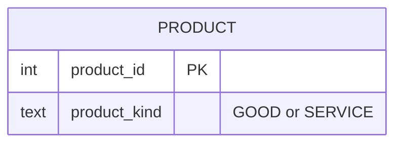

# Vol 1, Chapter 3 — ER diagram

The diagram shows what `schema.sql` implements, not the book's figures.
GOOD and SERVICE are values of `product.product_kind`, not tables.
Every table has a single-column key and plain foreign keys.

