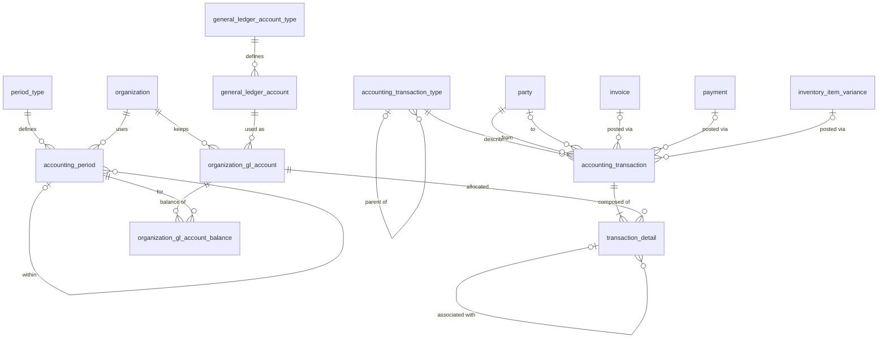

# Vol 1, Chapter 8 — ER diagram

Figs 8.1–8.3b. Tables from earlier chapters are shown by name only.

```mermaid
erDiagram
  general_ledger_account_type ||--o{ general_ledger_account : "defines"
  organization ||--o{ organization_gl_account : "keeps"
  general_ledger_account ||--o{ organization_gl_account : "used as"
  period_type ||--o{ accounting_period : "defines"
  organization ||--o{ accounting_period : "uses"
  accounting_period |o--o{ accounting_period : "within"
  accounting_transaction_type |o--o{ accounting_transaction_type : "parent of"
  accounting_transaction_type ||--o{ accounting_transaction : "describes"
  party ||--o{ accounting_transaction : "from"
  party |o--o{ accounting_transaction : "to"
  invoice |o--o{ accounting_transaction : "posted via"
  payment |o--o{ accounting_transaction : "posted via"
  inventory_item_variance |o--o{ accounting_transaction : "posted via"
  accounting_transaction ||--|{ transaction_detail : "composed of"
  organization_gl_account ||--o{ transaction_detail : "allocated"
  transaction_detail |o--o{ transaction_detail : "associated with"
  organization_gl_account ||--o{ organization_gl_account_balance : "balance of"
  accounting_period ||--o{ organization_gl_account_balance : "for"
```
