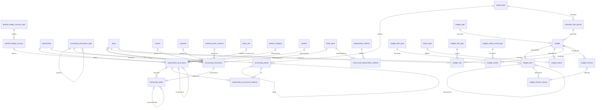

# Vol 1, Chapter 8 — ER diagram

Figs 8.1–8.8 (8.7a not built). Tables from earlier chapters are shown by name only.

```mermaid
erDiagram
  general_ledger_account_type ||--o{ general_ledger_account : "defines"
  organization ||--o{ organization_gl_account : "keeps"
  general_ledger_account ||--o{ organization_gl_account : "used as"
  period_type ||--o{ accounting_period : "defines"
  organization ||--o{ accounting_period : "uses"
  accounting_period |o--o{ accounting_period : "within"
  accounting_transaction_type |o--o{ accounting_transaction_type : "parent of"
  accounting_transaction_type ||--o{ accounting_transaction : "describes"
  party ||--o{ accounting_transaction : "from"
  party |o--o{ accounting_transaction : "to"
  invoice |o--o{ accounting_transaction : "posted via"
  payment |o--o{ accounting_transaction : "posted via"
  inventory_item_variance |o--o{ accounting_transaction : "posted via"
  accounting_transaction ||--|{ transaction_detail : "composed of"
  organization_gl_account ||--o{ transaction_detail : "allocated"
  transaction_detail |o--o{ transaction_detail : "associated with"
  organization_gl_account ||--o{ organization_gl_account_balance : "balance of"
  accounting_period ||--o{ organization_gl_account_balance : "for"
  organization_gl_account |o--o{ organization_gl_account : "comprised of"
  party_role |o--o{ organization_gl_account : "supplier or customer of"
  product_category |o--o{ organization_gl_account : "referenced by"
  product |o--o{ organization_gl_account : "referenced by"
  fixed_asset |o--o{ accounting_transaction : "depreciated via"
  fixed_asset ||--o{ fixed_asset_depreciation_method : "depreciated via"
  depreciation_method ||--o{ fixed_asset_depreciation_method : "defines"
  period_type ||--o{ standard_time_period : "describes"
  standard_time_period ||--o{ budget : "period for"
  budget_type ||--o{ budget : "describes"
  budget ||--|{ budget_item : "composed of"
  budget_item_type ||--o{ budget_item : "describes"
  budget_item |o--o{ budget_item : "comprised of"
  budget ||--o{ budget_status : "described by"
  status_type ||--o{ budget_status : "defines"
  budget ||--o{ budget_role : "involving"
  party ||--o{ budget_role : "involved in"
  budget_role_type ||--o{ budget_role : "used in"
  budget ||--o{ budget_revision : "revised with"
  budget_revision ||--|{ budget_revision_impact : "affecting"
  budget_item ||--o{ budget_revision_impact : "affected by"
  budget ||--o{ budget_review : "involving"
  party ||--o{ budget_review : "involved in"
  budget_review_result_type ||--o{ budget_review : "describes"
```
